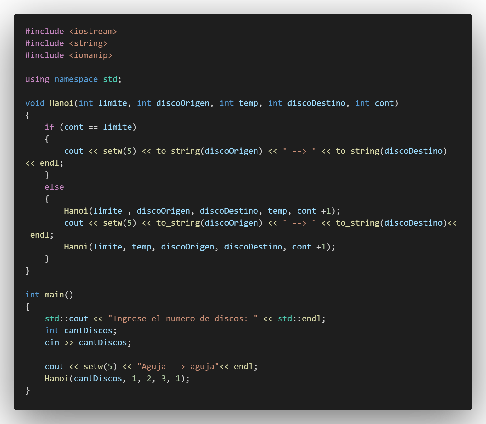
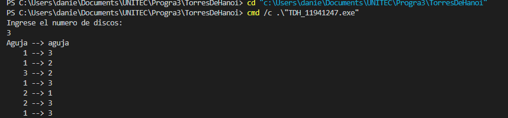

## :copyright: Autor

- :camera: 

- :man: **Daniel Morales**
- :e-mail: danielaugustoma@unitec.edu
- :link: [https://github.com/D11110](https://github.com/D11110)
- :calendar: 2020-09-06 23:00 CST

---

## :dart: Objetivos

Torres de Hanoi en **C++**:

---

## :black_circle: TDH_11941247.cpp

---

## :white_circle: Salida

---

## :computer: Código

- :blue_book: [C-_TDH](https://github.com/D11110/C-_TDH)

---

#### Herramientas:
- :package: [Visual Studio Code](https://code.visualstudio.com/)
- :camera: [Polacode-2020 v0.5.2](https://github.com/jeff-hykin/polacode)
- :notebook: [Markdown Cheatsheet](https://github.com/adam-p/markdown-here/wiki/Markdown-Cheatsheet)
- :smile: [Emoji Cheat Sheet](https://www.webfx.com/tools/emoji-cheat-sheet/)